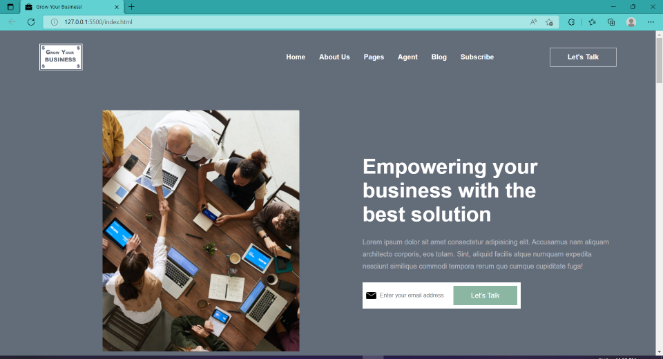
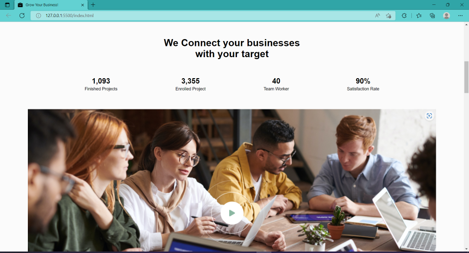
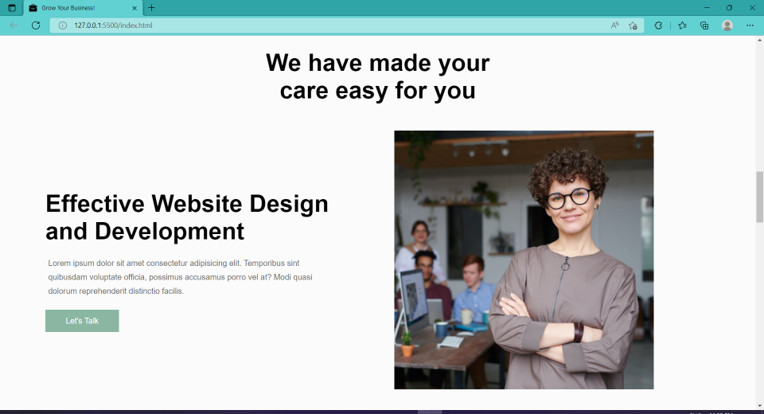
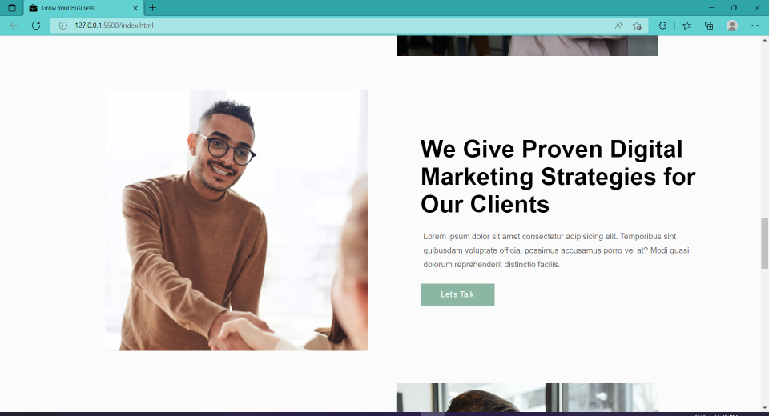
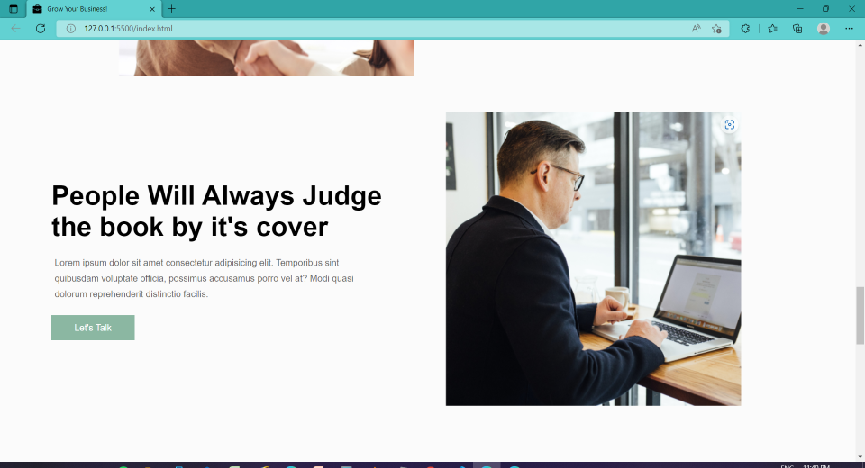
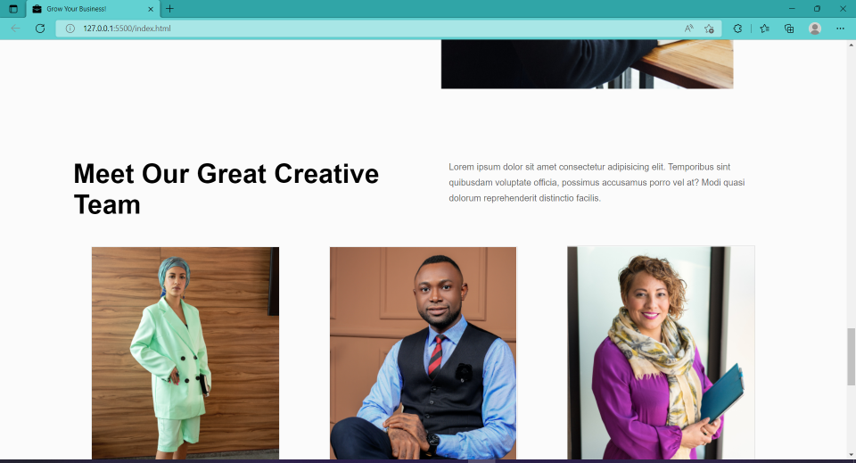
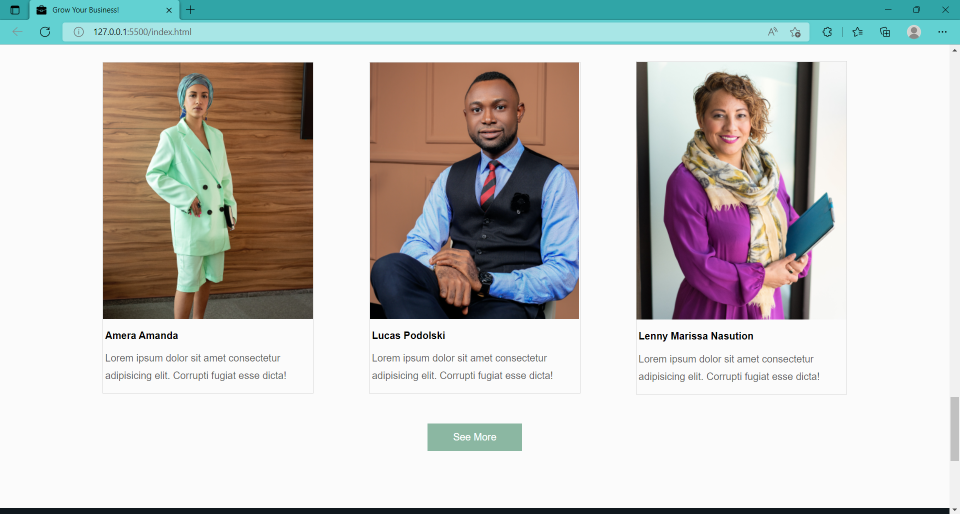
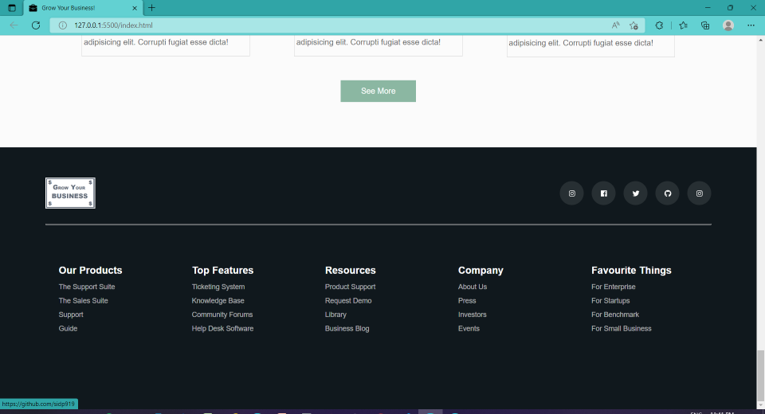

# Project-12 - A-Business-Development-Firm's-Landing-Page

## Description:

> A Business-Development-Firm's website's fully-responsive Landing page which will be the first web page that the potential client will see when he/she reaches firm's website.

# 

**Landing-Page-Images:**

#

## What I have learnt while making this project?

> Thanks to the previous project- FS-JS-WD-B-Project-11, this Project took lesser time to be completed, because I learned how to better organize my CSS classes and HTML code, which helped me save a lot of time.

> Also, although less but I have spent a considerable amount of time to make the Landing page look exactly as it was looking in the shared image of the Landing page or make it look even better. Not only that, I have put up a lot of effort in making this Landing Page fully Responsive on Desktops as well as Mobile Devices of all screen sizes.

> Also similar to previous projects, this project also helped me get better with using HTML & CSS to create stunning Landing pages without the use of any external libraries like Bootstrap or Tailwind CSS.

#

## Time taken to complete this project:
> Around 10 hrs spent in developing this Landing Page.

#

## Please see this project in action at below link:

**[Click to redirect to Project-12](https://p12-grow-your-business.netlify.app/)**

#

## Developed by:

**Sidharth Pandey**

**[Contact Me](mailto:sidp0008@gmail.com)**

#